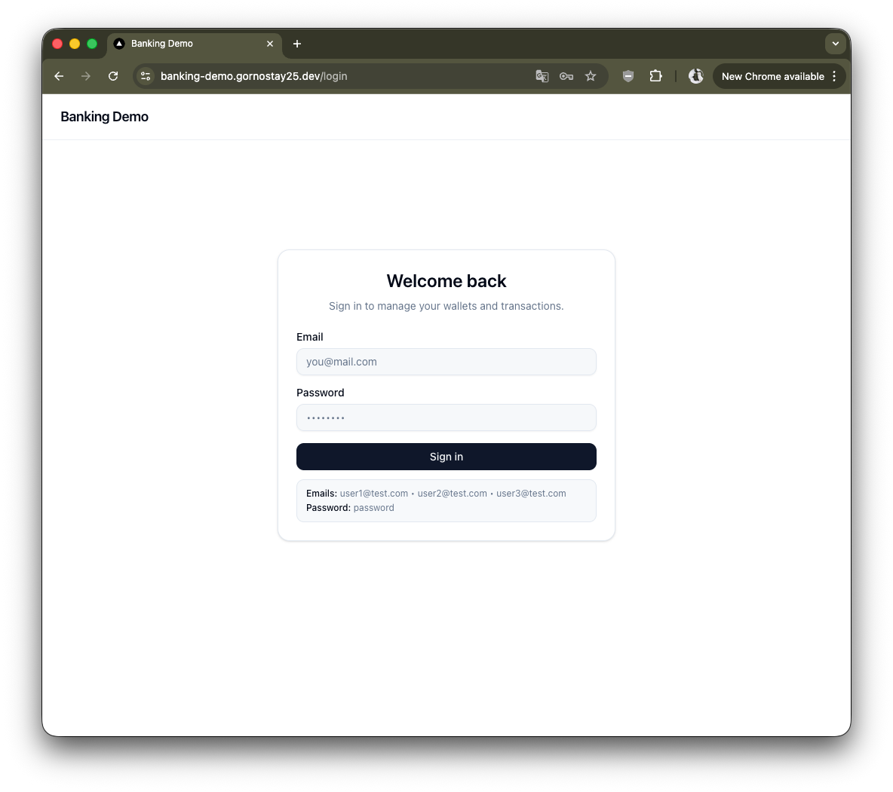
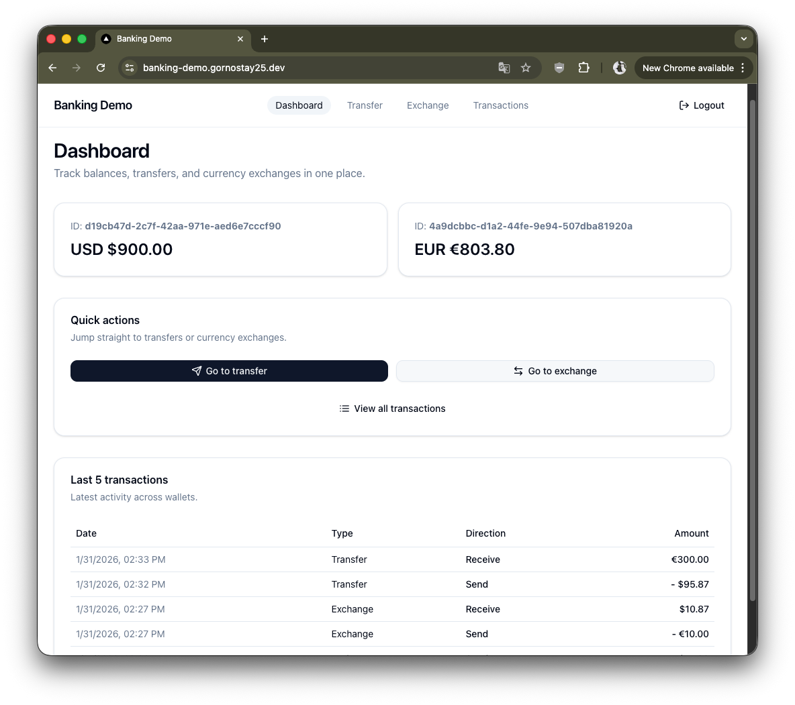
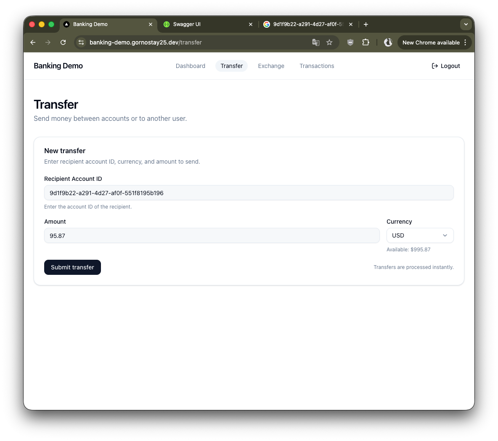
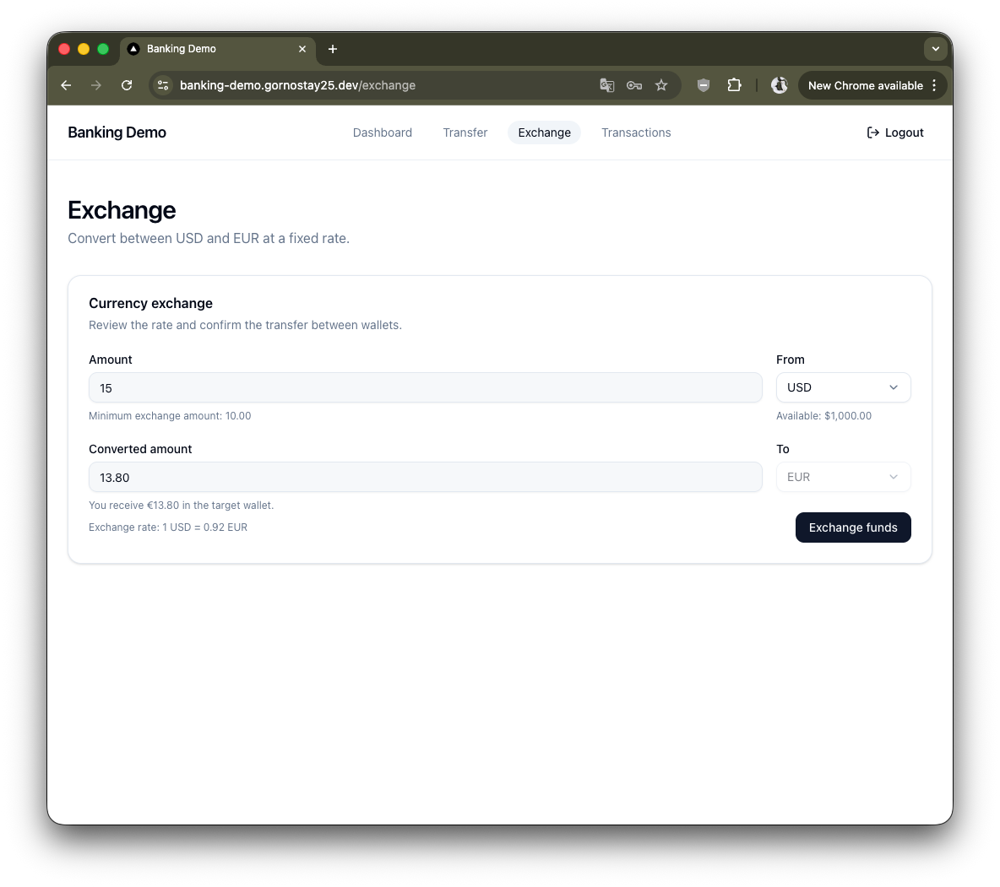
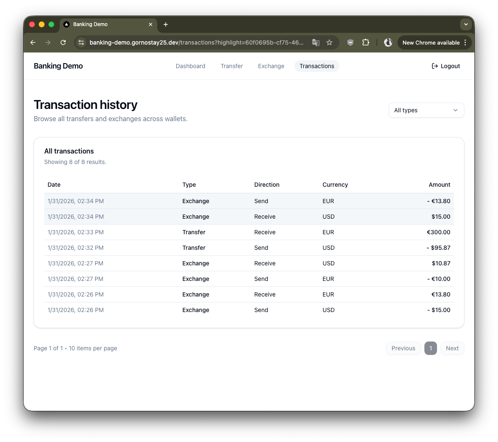

<!--
[x] Setup instructions
[x] Specify which user management approach was chosen (registration or pre-seeded)
[x] Design decisions and trade-offs
[x] Known limitations
[x] Any incomplete features due to time constraints
 -->

# Mini Banking Platform
_* Uses Go Blueprint for the project structure_

User Management Approach: Pre-seeded users
- 3 pre-seeded test users on initialization
- Each user has:
    - 1 USD account (initial balance: $1000.00)
    - 1 EUR account (initial balance: €500.00)

## Setup

Run the application
```bash
make run
```

More: See [banking/README.md](banking/README.md) for more details.

## Demo

|  |  |
| --- | --- |
|  |  |
|  |  |
|  |  |

## Design decisions and trade-offs

- No realtime updates for balances and transactions (incomplete features due to time constraints)
- Denormalized balances: `accounts.balance` is updated together with ledger inserts in the same DB transaction for fast reads
- Transfers are same-currency only (cross-currency is handled via a separate exchange operation)
- Exchange rate is fixed (no external provider / no historical rates)

## Known limitations
- no registration (only pre-seeded users)
- no pagination for ledger/transactions history
- no idempotency keys for transfer/exchange requests (client retries could create duplicate operations)
- no reconciliation/audit job to detect ledger vs balance drift

## Questions to Consider

<details>
<summary>How do you ensure transaction atomicity?</summary>
<p>
    <ul>
        <li><strong>Single DB transaction</strong>: all money-moving operations run inside one database transaction (<code>RunInTx</code>).</li>
        <li><strong>All-or-nothing</strong>: we lock accounts, insert <code>transactions</code>, insert 2 double-entry <code>ledger</code> rows, and update both balances in the same transaction.</li>
        <li><strong>Rollback on failure</strong>: if any step fails, the transaction is rolled back and no partial state is persisted.</li>
    </ul>
</p>
</details>

<details>
<summary>How do you prevent double-spending?</summary>
<p>
    <ul>
        <li><strong>Row-level locking</strong>: lock involved accounts with <code>SELECT ... FOR UPDATE</code> during transfer/exchange.</li>
        <li><strong>Serialization</strong>: concurrent spends against the same account are serialized (only one transaction can update that balance at a time).</li>
        <li><strong>Re-check after lock</strong>: sufficient-funds check is performed after acquiring the lock (inside the transaction) to avoid TOCTOU issues.</li>
        <li><strong>Deadlock avoidance</strong>: accounts are locked in a consistent order (by account ID).</li>
    </ul>
</p>
</details>

<details>
<summary>How do you maintain consistency between ledger entries and account balances?</summary>
<p>
    <ul>
        <li><strong>Same transaction</strong>: <code>ledger</code> inserts and <code>accounts.balance</code> updates are committed together.</li>
        <li><strong>Double-entry ledger</strong>: each operation creates 2 entries (debit is negative, credit is positive) linked by <code>transaction_id</code>.</li>
        <li><strong>Denormalized balance</strong>: <code>accounts.balance</code> is a derived/denormalized value used for fast reads, but it is updated atomically with the ledger.</li>
    </ul>
</p>
</details>

<details>
<summary>How would you handle decimal precision for different currencies?</summary>
<p>
    <ul>
        <li><strong>Current approach</strong>: Postgres uses <code>NUMERIC(19,2)</code> and Go uses <code>shopspring/decimal</code> (works well for USD/EUR with 2 decimals).</li>
        <li><strong>Multi-currency rule</strong>: store amounts as integer minor units (e.g. cents) and keep per-currency scale metadata (e.g. <code>minor_unit</code>).</li>
        <li><strong>Currency-aware validation</strong>: rounding/validation/formatting must follow each currency’s rules (including cash rounding where applicable).</li>
        <li><strong>If staying with NUMERIC</strong>: still enforce currency-aware rounding before persisting to avoid inconsistent representations.</li>
    </ul>
</p>
</details>

<details>
<summary>What indexing strategy would you use for the ledger table?</summary>
<p>
    <ul>
        <li><strong>Already in place</strong>: indexes on <code>ledger(account_id)</code>, <code>ledger(transaction_id)</code>, and <code>ledger(created_at)</code> cover the main query patterns.</li>
        <li><strong>Statements</strong>: add a composite index like <code>(account_id, created_at DESC)</code> to optimize pagination/sorting by time per account.</li>
        <li><strong>At scale</strong>: partition by <code>created_at</code> (time-based partitions) and index within partitions.</li>
    </ul>
</p>
</details>

<details>
<summary>How would you verify that balances are correctly synchronized?</summary>
<p>
    <ul>
        <li><strong>Reconciliation job</strong>: compare stored balances to ledger-derived balances (e.g. <code>SUM(ledger.amount)</code> grouped by <code>account_id</code>).</li>
        <li><strong>Safe execution</strong>: run on a consistent snapshot (or during low traffic) and alert on mismatches.</li>
        <li><strong>Optional healing</strong>: recalculate balances from ledger with a clear audit trail.</li>
        <li><strong>Tests</strong>: assert that “new balance = old balance + sum(new ledger entries)” for every operation.</li>
    </ul>
</p>
</details>

<details>
<summary>How would you scale this system for millions of users?</summary>
<p>
    <ul>
        <li><strong>Consistency first</strong>: keep the “money move” path strongly consistent (single-writer per account via row locks or partitioned ownership).</li>
        <li><strong>Scale reads</strong>: caching + read replicas for statement/history endpoints.</li>
        <li><strong>Scale writes</strong>: partition/shard hot tables (especially <code>ledger</code>) as volume grows.</li>
        <li><strong>Practical steps</strong>:
            <ul>
                <li>add pagination everywhere;</li>
                <li>partition <code>ledger</code> by time;</li>
                <li>use Redis for caching current balances (careful invalidation);</li>
                <li>add idempotency keys so client retries are safe;</li>
                <li>stream ledger events to an async pipeline (queue + OLAP) for analytics.</li>
            </ul>
        </li>
        <li><strong>Deployment / horizontal scaling</strong>: containerize the API with Docker and run multiple instances behind a load balancer (e.g. Compose/Kubernetes). Stateless JWT auth (e.g. via gin-jwt) helps here because sessions do not require server-side state, so scaling the API layer is straightforward.</li>
    </ul>
</p>
</details>
